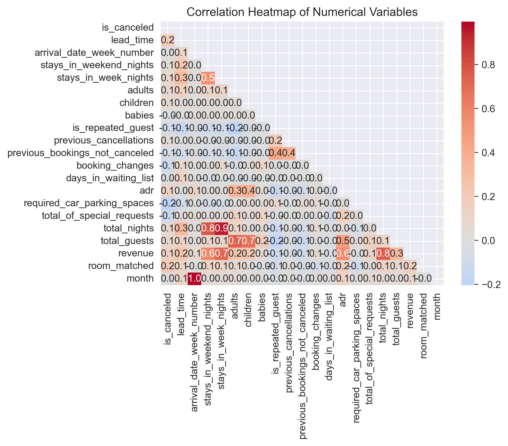
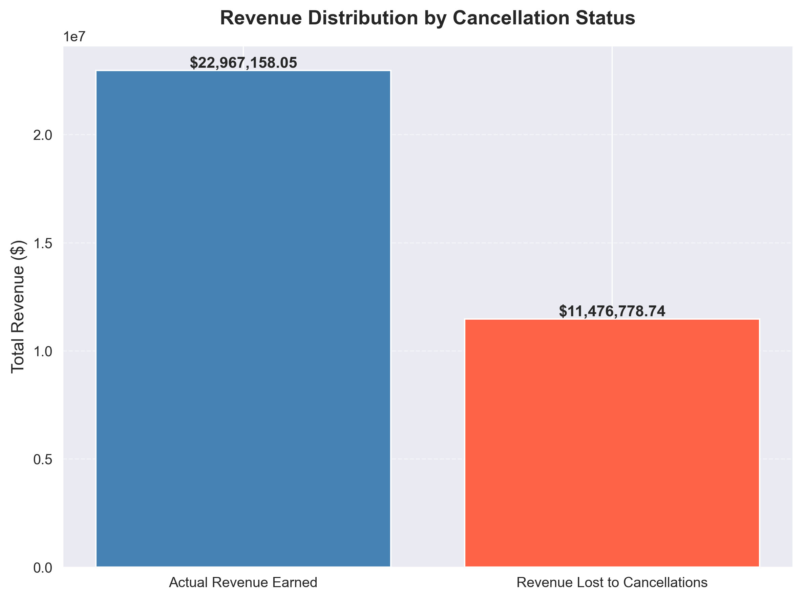
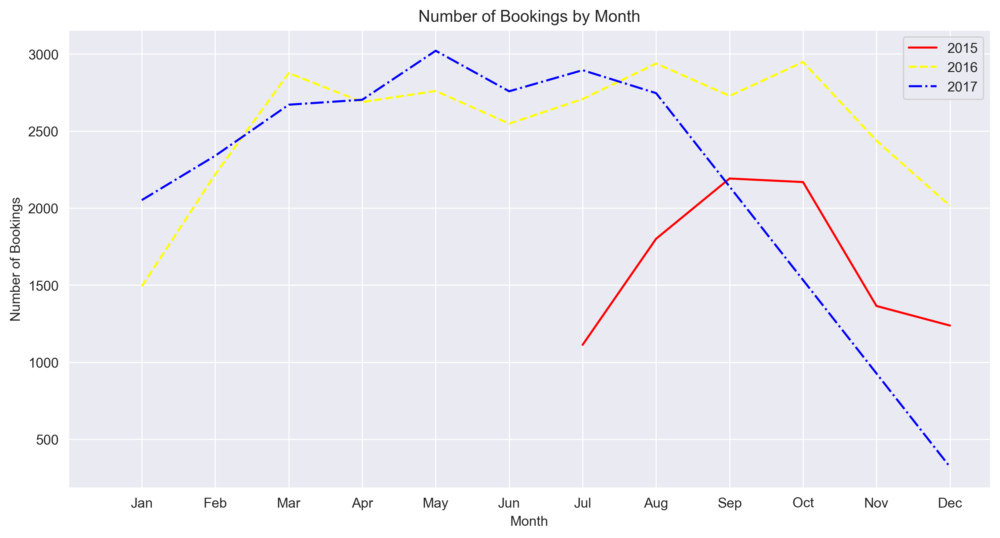
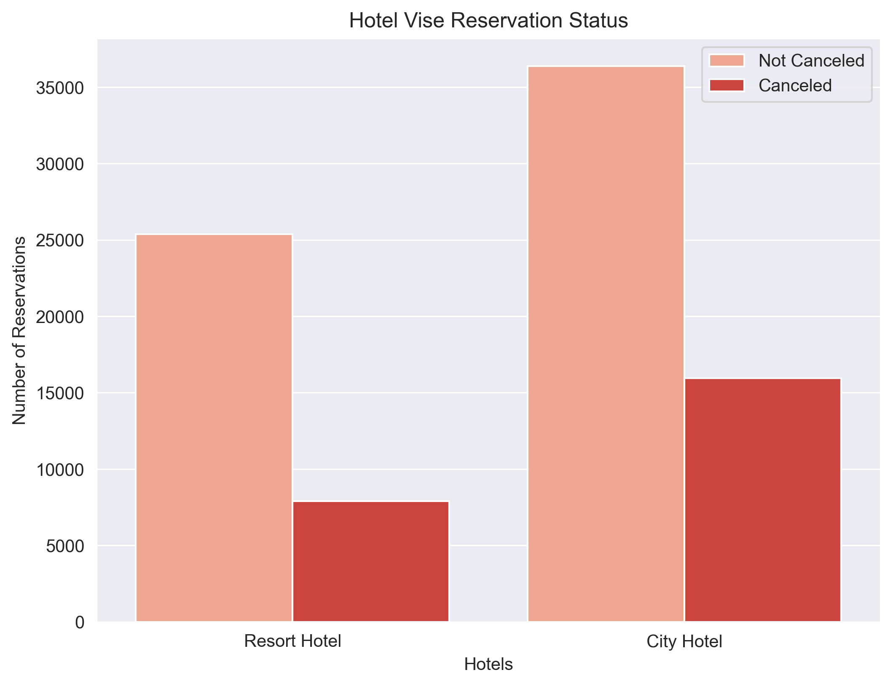

# 🏨 Hotel Booking Analysis

A complete end-to-end **Exploratory Data Analysis (EDA)** project on hotel booking data covering 86,634 bookings across two hotel types (Resort Hotel and City Hotel) from 2015 to 2017 — uncovering what drives cancellations, where revenue is being lost, and when demand peaks.

---

## 📌 Project Overview

This project answers four core business questions:

1. **Customer Behaviour** — Who books, how, and from where?
2. **Cancellation Drivers** — What causes and what prevents cancellations?
3. **Revenue Factors** — What drives hotel revenue?
4. **Seasonality & Revenue Peaks** — When is revenue highest and how do cancellations behave at that time?

---

## 📊 Dataset

| Detail | Value |
|--------|-------|
| Source | [Hotel Booking Demand — Kaggle](https://www.kaggle.com/datasets/jessemostipak/hotel-booking-demand) |
| Raw rows | 119,390 |
| Rows after cleaning | 86,634 |
| Columns | 32 |
| Period | July 2015 – August 2017 |
| Hotel types | Resort Hotel, City Hotel |

### Key Stats (Post-Cleaning)

| Metric | Value |
|--------|-------|
| Cancellation Rate | 27.7% |
| Average Daily Rate (ADR) | €103.14 |
| Avg. Length of Stay | 3.52 nights |
| Actual Revenue Earned | €22,967,611 |
| Revenue Lost to Cancellations | €11,483,435 |
| Repeat Guest Rate | 3.6% |
| Top Booking Segment | Online TA |
| Top Guest Country | Portugal (PRT) |
| Peak Revenue Month | August |

---

## 📈 Visual Highlights

**What drives cancellations — correlation heatmap**


**Revenue earned vs revenue lost to cancellations**


**Seasonality — bookings rate by month**


**Hotel Wise Cancellation - Which Hotel has most cancellations and reservatuions**


*More charts in the [images/](images/) folder and full walkthrough in the [notebook](notebooks/hotel_booking_analysis.ipynb).*

---

## 🗂️ Project Structure

```
hotel-booking-analysis/
│
├── notebooks/
│   └── hotel_booking_analysis.ipynb   # Main Jupyter notebook
│
├── reports/
│   └── Hotel_Booking_Analysis_Report.docx   # Full written report
│
├── images/                            # Exported charts (referenced above + more)
│   ├── 01_bookings_distribution.png
│   ├── 02_top_10_countries.png
│   ├── 03_market_segment.png
│   ├── 04_repeated_guest.png
│   ├── 05_hotel_vise_reservation_status.png
│   ├── 06_lead_time_cancellation.png
│   ├── 07_lead_time_cancellation_line.png
│   ├── 08_correlation_heatmap.png
│   ├── 09_hotel_revenue.png
│   ├── 10_revenue_by_room.png
│   ├── 11_revenue_by_total_nights.png
│   ├── 12_revenue_by_cancellation_status.png
│   ├── 13_month_booking_trend.png
│   ├── 14_repeated_guest_cancellation.png
│   └── 15_guest_stay_length.png
│
├── data/                              # Not tracked in git — see Dataset section
│   └── hotel_bookings.csv
│
├── README.md
└── requirements.txt
```

---

## 📓 Notebook Structure

| Section | Title | Description |
|---------|-------|-------------|
| 01 | Data Loading & Exploration | Shape, dtypes, null check, duplicates |
| 02 | Data Cleaning | Fix nulls, types, invalid rows, outliers |
| 03 | Feature Engineering | total_nights, revenue, season, lead_time_bucket, room_match |
| 04 | Customer Behaviour | Segments, channels, lead time, meal plan, stay patterns |
| 05 | Cancellation Analysis | Causes, preventers, correlation heatmap |
| 06 | Revenue & Pricing | ADR by room, segment, meal, channel; revenue vs lost |
| 07 | Seasonality | Peak months, dual-axis chart, net revenue after cancellations |
| 08 | Guest Profile & Loyalty | Lead time impact, repeat vs new, country map |
| 09 | Cancellation Prediction | Logistic Regression, feature importance, ROC curve |
| 10 | Findings & Recommendations | Key insights and business actions |

---

## 🛠️ Tech Stack

| Tool | Purpose |
|------|---------|
| Python 3.x | Core language |
| Pandas | Data manipulation |
| NumPy | Numerical operations |
| Matplotlib | Base visualisations |
| Seaborn | Statistical plots, heatmaps |
| Plotly Express | Interactive charts, choropleth map |
| Scikit-learn | Logistic regression model |
| Jupyter Notebook | Development environment |

---

## ⚙️ Setup & Installation

### 1. Clone the repository
```bash
git clone https://github.com/280205-Abhi/hotel-booking-analysis.git
cd hotel-booking-analysis
```

### 2. Create a virtual environment (recommended)
```bash
python -m venv venv
source venv/bin/activate        # Mac/Linux
venv\Scripts\activate           # Windows
```

### 3. Install dependencies
```bash
pip install -r requirements.txt
```

### 4. Get the dataset
Download `hotel_bookings.csv` from [Kaggle](https://www.kaggle.com/datasets/jessemostipak/hotel-booking-demand) and place it inside the `data/` folder.

### 5. Launch the notebook
```bash
jupyter notebook notebooks/hotel_booking_analysis.ipynb
```

---

## 🔑 Key Data Cleaning Steps

| Issue | Fix Applied |
|-------|------------|
| 31,994 duplicate rows (26.8%) | Dropped — completely identical across all 32 columns |
| `children` — 4 nulls | Filled with 0 |
| `country` — 488 nulls | Filled with 'Unknown' |
| `agent` — 16,340 nulls | Filled with 0 (no agent = direct booking) |
| `company` — 112,593 nulls | Filled with 0 (no company = individual booking) |
| `adr` negative values | Dropped rows where adr < 0 |
| Zero-guest rows | Dropped rows where adults + children + babies = 0 |
| Zero-night stays | Dropped rows where total_nights = 0 |

---

## 🔧 Engineered Features

| Feature | Formula / Logic |
|---------|----------------|
| `total_nights` | `stays_in_weekend_nights + stays_in_week_nights` |
| `total_guests` | `adults + children + babies` |
| `revenue` | `adr × total_nights` (actual earned: only non-cancelled) |
| `revenue_lost` | `adr × total_nights` for cancelled bookings only |
| `arrival_date` | Combined datetime from year + month + day columns |
| `season` | Mapped from month → Summer / Autumn / Winter / Spring |
| `lead_time_bucket` | Binned: Same-day / Last-minute / Short / Medium / Long / Very Long |
| `room_match` | 1 if reserved_room_type == assigned_room_type else 0 |
| `is_high_season` | 1 for June–September, 0 otherwise |

---

## 💡 Key Findings

- **27.7% cancellation rate** after cleaning — City Hotel cancels more than Resort Hotel
- **€11.48M revenue lost** to cancellations — 33.3% of potential total revenue
- **August** is the peak revenue month; cancellation rate also rises during this period
- **Online TA** is the largest segment but also has the highest cancellation rate
- **Non-refundable deposit** bookings paradoxically show higher cancellation rates
- **Repeat guests** cancel at a much lower rate than first-time guests (3.6% repeat rate overall)
- **Special requests** are the strongest negative predictor of cancellation
- **Lead time** is the strongest positive predictor — longer lead = higher cancel risk

---

## 📈 Business Recommendations

1. **Overbooking strategy** for peak months (Jul–Aug) to offset anticipated cancellations
2. **Loyalty programme** to convert first-time Transient guests into repeat customers
3. **Prompt special requests** at booking time — reduces cancellation probability significantly
4. **Review OTA cancellation policies** — negotiate stricter terms with Online TA partners
5. **Targeted email reminders** at 90, 30, and 7 days for long lead-time bookings
6. **Re-examine deposit policy** — Non Refund deposits are not reducing cancellations as expected

---

## 👤 Author

**Abhinav Dasari**
B.Tech Information Technology — 4th Year
Campus Placement Project | June 2026

[GitHub](https://github.com/280205-Abhi) · [LinkedIn](https://www.linkedin.com/in/abhinavdasari28/)

---

## 📄 License

This project is for educational and portfolio purposes.
Dataset credit: [Antonio, Almeida & Nunes, 2019](https://www.sciencedirect.com/science/article/pii/S2352340918315191)
